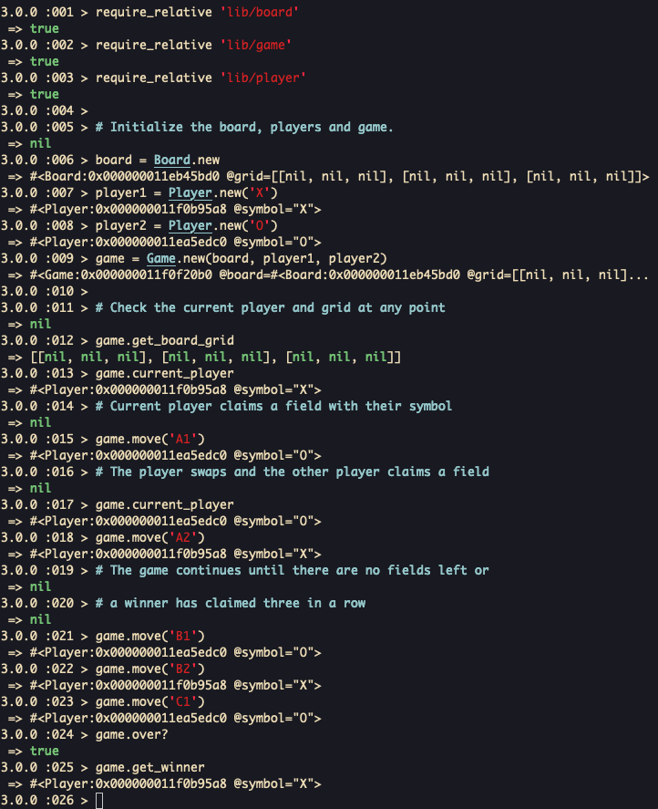

# Tic Tac Toe Tech Test

My solution to the Makers Academy Tic Tac Toe tech test. The project includes the business logic for the game of tic tac toe.

## Setup

Clone the repository, install dependencies, and run tests:
```shell
git clone https://github.com/ev-th/tic-tac-toe-tech-test.git
cd tic-tac-toe-tech-test
bundle install
rspec
```

## Usage

You can interact with with program in IRB
```ruby
# Require the files.
require_relative 'lib/board'
require_relative 'lib/game'
require_relative 'lib/player'

# Initialize the board, players and game.
board = Board.new
player1 = Player.new('X')
player2 = Player.new('O')
game = Game.new(board, player1, player2)

# Check the current player and grid at any point
game.get_board_grid
game.current_player

# Current player claims a field with their symbol
game.move('A1')

# The player swaps and the other player claims a field
game.current_player
game.move('A2')

# The game continues until there are no fields left or
# a winner has claimed three in a row
game.move('B1')
game.move('B2')
game.move('C1')
game.over?
game.get_winner
```

## Demonstration


The following is the original specification from Makers Academy

# Try our Tic Tac Toe Tech Test!

This is a very common tech test as it demonstrates a candidate's knowledge of basic data structures.

## The brief

The rules of tic tac toe are as follows:

* There are two players in the game (X and O)
* Players take turns until the game is over
* A player can claim a field if it is not already taken
* A turn ends when a player claims a field
* A player wins if they claim all the fields in a row, column or diagonal
* A game is over if a player wins
* A game is over when all fields are taken

Build the business logic for a game of tic tac toe. It should be easy to implement a working game of tic tac toe by combining your code with any user interface, whether web or command line.

<!-- BEGIN GENERATED SECTION DO NOT EDIT -->

---

**How was this resource?**  
[😫](https://airtable.com/shrUJ3t7KLMqVRFKR?prefill_Repository=makersacademy/course&prefill_File=individual_challenges/tic_tac_toe.md&prefill_Sentiment=😫) [😕](https://airtable.com/shrUJ3t7KLMqVRFKR?prefill_Repository=makersacademy/course&prefill_File=individual_challenges/tic_tac_toe.md&prefill_Sentiment=😕) [😐](https://airtable.com/shrUJ3t7KLMqVRFKR?prefill_Repository=makersacademy/course&prefill_File=individual_challenges/tic_tac_toe.md&prefill_Sentiment=😐) [🙂](https://airtable.com/shrUJ3t7KLMqVRFKR?prefill_Repository=makersacademy/course&prefill_File=individual_challenges/tic_tac_toe.md&prefill_Sentiment=🙂) [😀](https://airtable.com/shrUJ3t7KLMqVRFKR?prefill_Repository=makersacademy/course&prefill_File=individual_challenges/tic_tac_toe.md&prefill_Sentiment=😀)  
Click an emoji to tell us.

<!-- END GENERATED SECTION DO NOT EDIT -->